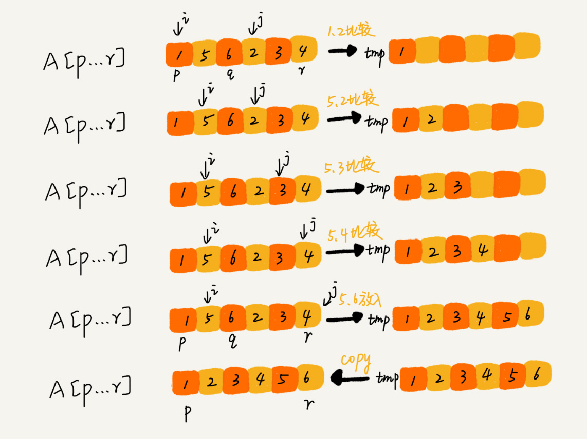

# C语言 数据结构学习

## 单链表 初始化 头节点

[linked_single_init_head.c](linked_single_init_head.c)

仅初始化单节点，并保留头节点。下面是运行后打印的结果：

```
node[0]->value:-842150451
node[1]->value:1
node[2]->value:2
node[3]->value:3
node[4]->value:4
```

## 单链表 查询值 删除值

[linked_single_find_del.c](linked_single_find_del.c)

在单链表中查询指定值，并返回匹配节点的指针，打印值。找不到就打印-1，删除指定值的节点。运行后打印结果：

```
node[0]:-842150451
node[1]:1
node[2]:2
node[3]:3
node[4]:4
now:3
next:4
node[0]:-842150451
node[1]:1
node[2]:3
node[3]:4
```

## 单链表 循环链表

[linked_loop.c](linked_loop.c)

循环链表中插入节点，删除指定值的节点。运行后打印结果：

<details>
<summary>展开查看</summary>

```
node[0]: 0, next:node[1]: 1
node[1]: 1, next:node[1]: 2
node[2]: 2, next:node[2]: 3
node[3]: 3, next:node[0]: 0

insert -1 after node->value == 0
node[0]: 0, next:node[1]:-1
node[1]:-1, next:node[1]: 1
node[2]: 1, next:node[2]: 2
node[3]: 2, next:node[3]: 3
node[4]: 3, next:node[0]: 0

insert -1 after node->value == 1
node[0]: 0, next:node[1]:-1
node[1]:-1, next:node[1]: 1
node[2]: 1, next:node[2]:-1
node[3]:-1, next:node[3]: 2
node[4]: 2, next:node[4]: 3
node[5]: 3, next:node[0]: 0

insert -1 after node->value == 3
node[0]: 0, next:node[1]:-1
node[1]:-1, next:node[1]: 1
node[2]: 1, next:node[2]:-1
node[3]:-1, next:node[3]: 2
node[4]: 2, next:node[4]: 3
node[5]: 3, next:node[5]:-1
node[6]:-1, next:node[0]: 0

insert -1 after node->value == 6
node[0]: 0, next:node[1]:-1
node[1]:-1, next:node[1]: 1
node[2]: 1, next:node[2]:-1
node[3]:-1, next:node[3]: 2
node[4]: 2, next:node[4]: 3
node[5]: 3, next:node[5]:-1
node[6]:-1, next:node[0]: 0

rm node->value == -1
node[0]: 0, next:node[1]: 1
node[1]: 1, next:node[1]: 2
node[2]: 2, next:node[2]: 3
node[3]: 3, next:node[0]: 0
```
</details>

## 双向链表

[linked_double.c](linked_double.c)

在双向链表，任意下标位置后面插入节点。删除任意下标的节点。运行后打印结果：

<details>
<summary>展开查看</summary>

```
+----------------------+-------------------+---------------------+
|         prior        |        now        |         next        |
|----------------------------------------------------------------|
| Node[-1]->value:NULL | Node[0]->value: 0 | Node[1]->value:   1 |
| Node[ 0]->value:   0 | Node[1]->value: 1 | Node[2]->value:   2 |
| Node[ 1]->value:   1 | Node[2]->value: 2 | Node[3]->value:   3 |
| Node[ 2]->value:   2 | Node[3]->value: 3 | Node[4]->value:NULL |
+----------------------+-------------------+---------------------+

inser -1 after node[1]
+----------------------+-------------------+---------------------+
|         prior        |        now        |         next        |
|----------------------------------------------------------------|
| Node[-1]->value:NULL | Node[0]->value: 0 | Node[1]->value:   1 |
| Node[ 0]->value:   0 | Node[1]->value: 1 | Node[2]->value:  -1 |
| Node[ 1]->value:   1 | Node[2]->value:-1 | Node[3]->value:   2 |
| Node[ 2]->value:   1 | Node[3]->value: 2 | Node[4]->value:   3 |
| Node[ 3]->value:   2 | Node[4]->value: 3 | Node[5]->value:NULL |
+----------------------+-------------------+---------------------+

inser -1 after node[4]
+----------------------+-------------------+---------------------+
|         prior        |        now        |         next        |
|----------------------------------------------------------------|
| Node[-1]->value:NULL | Node[0]->value: 0 | Node[1]->value:   1 |
| Node[ 0]->value:   0 | Node[1]->value: 1 | Node[2]->value:  -1 |
| Node[ 1]->value:   1 | Node[2]->value:-1 | Node[3]->value:   2 |
| Node[ 2]->value:   1 | Node[3]->value: 2 | Node[4]->value:   3 |
| Node[ 3]->value:   2 | Node[4]->value: 3 | Node[5]->value:  -1 |
| Node[ 4]->value:   3 | Node[5]->value:-1 | Node[6]->value:NULL |
+----------------------+-------------------+---------------------+

inser -1 after node[3]
+----------------------+-------------------+---------------------+
|         prior        |        now        |         next        |
|----------------------------------------------------------------|
| Node[-1]->value:NULL | Node[0]->value: 0 | Node[1]->value:   1 |
| Node[ 0]->value:   0 | Node[1]->value: 1 | Node[2]->value:  -1 |
| Node[ 1]->value:   1 | Node[2]->value:-1 | Node[3]->value:   2 |
| Node[ 2]->value:   1 | Node[3]->value: 2 | Node[4]->value:  -1 |
| Node[ 3]->value:   2 | Node[4]->value:-1 | Node[5]->value:   3 |
| Node[ 4]->value:   2 | Node[5]->value: 3 | Node[6]->value:  -1 |
| Node[ 5]->value:   3 | Node[6]->value:-1 | Node[7]->value:NULL |
+----------------------+-------------------+---------------------+

rm node[2]
+----------------------+-------------------+---------------------+
|         prior        |        now        |         next        |
|----------------------------------------------------------------|
| Node[-1]->value:NULL | Node[0]->value: 0 | Node[1]->value:   1 |
| Node[ 0]->value:   0 | Node[1]->value: 1 | Node[2]->value:   2 |
| Node[ 1]->value:   1 | Node[2]->value: 2 | Node[3]->value:  -1 |
| Node[ 2]->value:   2 | Node[3]->value:-1 | Node[4]->value:   3 |
| Node[ 3]->value:   2 | Node[4]->value: 3 | Node[5]->value:  -1 |
| Node[ 4]->value:   3 | Node[5]->value:-1 | Node[6]->value:NULL |
+----------------------+-------------------+---------------------+

rm node[3]
+----------------------+-------------------+---------------------+
|         prior        |        now        |         next        |
|----------------------------------------------------------------|
| Node[-1]->value:NULL | Node[0]->value: 0 | Node[1]->value:   1 |
| Node[ 0]->value:   0 | Node[1]->value: 1 | Node[2]->value:   2 |
| Node[ 1]->value:   1 | Node[2]->value: 2 | Node[3]->value:   3 |
| Node[ 2]->value:   2 | Node[3]->value: 3 | Node[4]->value:  -1 |
| Node[ 3]->value:   3 | Node[4]->value:-1 | Node[5]->value:NULL |
+----------------------+-------------------+---------------------+

rm node[4]
+----------------------+-------------------+---------------------+
|         prior        |        now        |         next        |
|----------------------------------------------------------------|
| Node[-1]->value:NULL | Node[0]->value: 0 | Node[1]->value:   1 |
| Node[ 0]->value:   0 | Node[1]->value: 1 | Node[2]->value:   2 |
| Node[ 1]->value:   1 | Node[2]->value: 2 | Node[3]->value:   3 |
| Node[ 2]->value:   2 | Node[3]->value: 3 | Node[4]->value:NULL |
+----------------------+-------------------+---------------------+
```
</details>

## 双向循环链表

[linked_double_loop.c](linked_double_loop.c)

在双向循环链表，任意下标位置的后面插入节点，删除指定值的节点。运行后打印结果：

<details>
<summary>展开查看</summary>

```
+--------------------+-------------------+-------------------+
|        prior       |        now        |        next       |
|------------------------------------------------------------|
| node[-1]->value: 4 | node[0]->value: 0 | node[1]->value: 1 |
| node[ 0]->value: 0 | node[1]->value: 1 | node[2]->value: 2 |
| node[ 1]->value: 1 | node[2]->value: 2 | node[3]->value: 3 |
| node[ 2]->value: 2 | node[3]->value: 3 | node[4]->value: 4 |
| node[ 3]->value: 3 | node[4]->value: 4 | node[5]->value: 0 |
+--------------------+-------------------+-------------------+

insert -1 after node->value == 0
+--------------------+-------------------+-------------------+
|        prior       |        now        |        next       |
|------------------------------------------------------------|
| node[-1]->value: 4 | node[0]->value: 0 | node[1]->value:-1 |
| node[ 0]->value: 0 | node[1]->value:-1 | node[2]->value: 1 |
| node[ 1]->value:-1 | node[2]->value: 1 | node[3]->value: 2 |
| node[ 2]->value: 1 | node[3]->value: 2 | node[4]->value: 3 |
| node[ 3]->value: 2 | node[4]->value: 3 | node[5]->value: 4 |
| node[ 4]->value: 3 | node[5]->value: 4 | node[6]->value: 0 |
+--------------------+-------------------+-------------------+

insert -1 after node->value == 2
+--------------------+-------------------+-------------------+
|        prior       |        now        |        next       |
|------------------------------------------------------------|
| node[-1]->value: 4 | node[0]->value: 0 | node[1]->value:-1 |
| node[ 0]->value: 0 | node[1]->value:-1 | node[2]->value: 1 |
| node[ 1]->value:-1 | node[2]->value: 1 | node[3]->value:-1 |
| node[ 2]->value: 1 | node[3]->value:-1 | node[4]->value: 2 |
| node[ 3]->value:-1 | node[4]->value: 2 | node[5]->value: 3 |
| node[ 4]->value: 2 | node[5]->value: 3 | node[6]->value: 4 |
| node[ 5]->value: 3 | node[6]->value: 4 | node[7]->value: 0 |
+--------------------+-------------------+-------------------+

insert -1 after node->value == 7
+--------------------+-------------------+-------------------+
|        prior       |        now        |        next       |
|------------------------------------------------------------|
| node[-1]->value: 4 | node[0]->value: 0 | node[1]->value:-1 |
| node[ 0]->value: 0 | node[1]->value:-1 | node[2]->value:-1 |
| node[ 1]->value:-1 | node[2]->value:-1 | node[3]->value: 1 |
| node[ 2]->value:-1 | node[3]->value: 1 | node[4]->value:-1 |
| node[ 3]->value: 1 | node[4]->value:-1 | node[5]->value: 2 |
| node[ 4]->value:-1 | node[5]->value: 2 | node[6]->value: 3 |
| node[ 5]->value: 2 | node[6]->value: 3 | node[7]->value: 4 |
| node[ 6]->value: 3 | node[7]->value: 4 | node[8]->value: 0 |
+--------------------+-------------------+-------------------+

rm node->value==-1
+--------------------+-------------------+-------------------+
|        prior       |        now        |        next       |
|------------------------------------------------------------|
| node[-1]->value: 4 | node[0]->value: 0 | node[1]->value: 1 |
| node[ 0]->value: 0 | node[1]->value: 1 | node[2]->value: 2 |
| node[ 1]->value: 1 | node[2]->value: 2 | node[3]->value: 3 |
| node[ 2]->value: 2 | node[3]->value: 3 | node[4]->value: 4 |
| node[ 3]->value: 3 | node[4]->value: 4 | node[5]->value: 0 |
+--------------------+-------------------+-------------------+

rm node->value==-2
+--------------------+-------------------+-------------------+
|        prior       |        now        |        next       |
|------------------------------------------------------------|
| node[-1]->value: 4 | node[0]->value: 0 | node[1]->value: 1 |
| node[ 0]->value: 0 | node[1]->value: 1 | node[2]->value: 2 |
| node[ 1]->value: 1 | node[2]->value: 2 | node[3]->value: 3 |
| node[ 2]->value: 2 | node[3]->value: 3 | node[4]->value: 4 |
| node[ 3]->value: 3 | node[4]->value: 4 | node[5]->value: 0 |
+--------------------+-------------------+-------------------+
```
</details>

## 顺序栈

[stack_array.c](stack_array.c)

最基本的栈，基于数组实现。运行后打印结果：

```
1 1 1 1 1 1 0
5 4 3 2 1 0 0
```

## 链式栈

[stack_linked.c](stack_linked.c)

使用链表的头插法实现的栈，可以无限扩容。运行后打印结果;

```
1 1 1 1 1
5 4 3 2 1 0
```

## 顺序队列

[queue_array.c](queue_array.c)

使用数组实现的队列，可以自动搬移数据至头部。运行后打印结果：

```
0 1 2 3 4 5
dequeue num:0 1 2
3 4 5 6 7 8
```

## 链式队列

[queue_linked.c](queue_linked.c)

使用链表实现的队列，可以完成入列和出列。运行后打印结果：

```
0 1 2 3 0 0
```

## 树的三种遍历

[tree_order.c](tree_order.c)


> 图片版权 © 归极客邦科技所有 [极客时间@王争 数据结构与算法之美](https://time.geekbang.org/column/intro/126)

初始化树，并分别使用递归实现，前序/中序/后续 排列，统计叶子节点个数。运行后打印结果：

```
preOrder :ABDECFG
inOrder  :DBEAFCG
pastOrder:DEBFGCA
conutLeaf:4
```

## 查找二叉树

[tree_search.c](tree_search.c)


> 图片版权 © 归极客邦科技所有 [极客时间@王争 数据结构与算法之美](https://time.geekbang.org/column/intro/126)

在查找二叉树中 插入/查找/删除 任意值。运行后打印结果：

<details>
<summary>展开查看</summary>

```
66
0

original:
preOrder :33 16 13 15 18 17 25 19 27 50 34 58 51 55 66
inOrder  :13 15 16 17 18 19 25 27 33 34 50 51 55 58 66
pastOrder:15 13 17 19 27 25 18 16 34 55 51 66 58 50 33

del 55 after:
preOrder :33 16 13 15 18 17 25 19 27 50 34 58 51 66
inOrder  :13 15 16 17 18 19 25 27 33 34 50 51 58 66
pastOrder:15 13 17 19 27 25 18 16 34 51 66 58 50 33

del 13 after:
preOrder :33 16 15 18 17 25 19 27 50 34 58 51 66
inOrder  :15 16 17 18 19 25 27 33 34 50 51 58 66
pastOrder:15 17 19 27 25 18 16 34 51 66 58 50 33

del 18 after:
preOrder :33 16 15 19 17 25 27 50 34 58 51 66
inOrder  :15 16 17 19 25 27 33 34 50 51 58 66
pastOrder:15 17 27 25 19 16 34 51 66 58 50 33

depth:5
```
</details>

## Huffman 树

[tree_huffman.c](tree_huffman.c)

未完成

## 冒泡排序

[sort_bubble.c](sort_bubble.c)

也就是一般的冒泡排序了，当没有数据交换时，也就是说数据已经完全有序时，会提前结束循环。运行后打印结果：

```
4 5 6 3 2 1 0
0 1 2 3 4 5 6
```

## 插入排序

[sort_insert.c](sort_insert.c)


> 图片版权 © 归极客邦科技所有 [极客时间@王争 数据结构与算法之美](https://time.geekbang.org/column/intro/126)

插入排序，将数组分为两段：已排序和未排序。把未排序的数，和已排序的数进行对比，并将未排序的数插入到已排序数组中的合适位置。运行后打印结果：

```
4 5 6 1 3 2
1 2 3 4 5 6
```

## 希尔排序

分别使用步进 5 3 1 对数组进行希尔排序。

[sort_shell.c](sort_shell.c)

对每个步进排序进行分解

<details>
<summary>展开查看</summary>

例如，假设有这样一组数[ 13 14 94 33 82 25 59 94 65 23 45 27 73 25 39 10 ]，如果我们以步长为5开始进行排序，我们可以通过将这列表放在有5列的表中来更好地描述算法，这样他们就应该看起来是这样：

```
13 14 94 33 82
25 59 94 65 23
45 27 73 25 39
10
```

然后我们对每列进行排序：

```
10 14 73 25 23
13 27 94 33 39
25 59 94 65 82
45
```

将上述四行数字，依序接在一起时我们得到：[ 10 14 73 25 23 13 27 94 33 39 25 59 94 65 82 45 ].这时10已经移至正确位置了，然后再以3为步长进行排序：

```
10 14 73
25 23 13
27 94 33
39 25 59
94 65 82
45
```

排序之后变为：

```
10 14 13
25 23 33
27 25 59
39 65 73
45 94 82
94
```
最后以1步长进行排序（此时就是简单的插入排序了）。

</details>

程序运行后打印结果：

```
10 14 73 25 23 13 27 94 33 39 25 59 94 65 82 45
10 13 14 23 25 25 27 33 39 45 59 65 73 82 94 94
```

## 选择排序

把数组分为两部分，未排序和已排序。在未排序部分中，寻找一个最小的数，放在已排序区域的最后面(与它交换位置)。最后一位不用换，因为已经有序。毕竟只剩它一个了，肯定是最大的。

[sort_select.c](sort_select.c)


> 图片版权 © 归极客邦科技所有 [极客时间@王争 数据结构与算法之美](https://time.geekbang.org/column/intro/126)

运行后打印结果：

```
4 5 6 1 3 2
1 2 3 4 5 6
```

## 归并排序

把数组从中间对半分成两份，对左边和右边都分别进行排序，最后在合并在一起。

[sort_merge.c](sort_merge.c)




> 图片版权 © 归极客邦科技所有 [极客时间@王争 数据结构与算法之美](https://time.geekbang.org/column/intro/126)

运行后打印结果：

```
1 5 6 2 3 4
1 2 3 4 5 6
```

## 快速排序

任意取数组中的一个数（程序取的最后一个），然后遍历数组，将比它小的数放在前面，比它大的放在后面。

[sort_quick.c](sort_quick.c)


> 图片版权 © 归极客邦科技所有 [极客时间@王争 数据结构与算法之美](https://time.geekbang.org/column/intro/126)

程序运行后打印结果：

```
8 10 2 3 6 1 5
1 2 3 5 6 8 10
```

# TODO

## 单链表

- [X] 循环链表
- [X] 双向链表
- [X] 双向循环链表

## 栈与队列

- [X] 顺序栈（基于数组）
- [X] 链式栈（基于链表）
- [X] 顺序队列（基于数组）
- [X] 链式队列（基于链表）

## 树

- [X] 前/中/后 序遍历树
- [X] 查找二叉树
- [ ] Huffman 树

## 排序

- [X] 冒泡排序
- [X] 插入排序
- [X] 希尔排序
- [X] 选择排序
- [X] 归并排序
- [X] 快速排序
- [ ] 堆排序

## 查找

- [ ] 二分查找

## 散列

- [ ] 了解

## 哈希

- [ ] 了解

# License

This is free and unencumbered software released into the public domain.

Anyone is free to copy, modify, publish, use, compile, sell, or
distribute this software, either in source code form or as a compiled
binary, for any purpose, commercial or non-commercial, and by any
means.

In jurisdictions that recognize copyright laws, the author or authors
of this software dedicate any and all copyright interest in the
software to the public domain. We make this dedication for the benefit
of the public at large and to the detriment of our heirs and
successors. We intend this dedication to be an overt act of
relinquishment in perpetuity of all present and future rights to this
software under copyright law.

THE SOFTWARE IS PROVIDED "AS IS", WITHOUT WARRANTY OF ANY KIND,
EXPRESS OR IMPLIED, INCLUDING BUT NOT LIMITED TO THE WARRANTIES OF
MERCHANTABILITY, FITNESS FOR A PARTICULAR PURPOSE AND NONINFRINGEMENT.
IN NO EVENT SHALL THE AUTHORS BE LIABLE FOR ANY CLAIM, DAMAGES OR
OTHER LIABILITY, WHETHER IN AN ACTION OF CONTRACT, TORT OR OTHERWISE,
ARISING FROM, OUT OF OR IN CONNECTION WITH THE SOFTWARE OR THE USE OR
OTHER DEALINGS IN THE SOFTWARE.